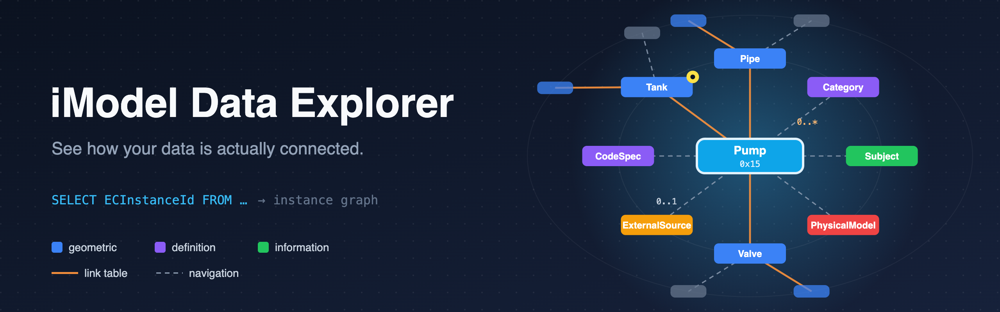
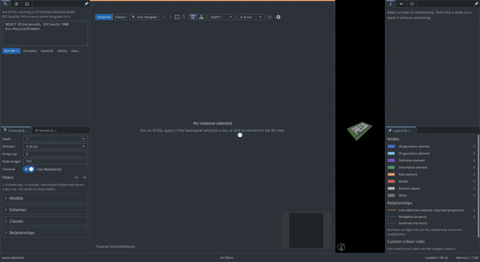

<p align="center">
  
</p>

# iModel Data Explorer

A developer tool for exploring the **instance graph** of an [iModel](https://www.itwinjs.org/learning/imodels/): the actual [EC](https://www.itwinjs.org/bis/ec/) instances and the
relationships between them, rather than the schema. Open a `.bim` file, pick a starting instance
with any [ECSQL](https://www.itwinjs.org/learning/ecsql/) query, and see what it is connected to, as many hops out as you like.

<p align="center">
  <a href="https://youtu.be/z3VgKTD08x0">
    
  </a>
  <br>
  <a href="https://youtu.be/z3VgKTD08x0">Watch the full demo on YouTube</a>
</p>

Built on [iTwin.js](https://www.itwinjs.org/) 5.x, the open-source library behind Bentley's
[iTwin Platform](https://www.bentley.com/products/itwin-platform/), using
[Electron](https://www.itwinjs.org/learning/writeaninteractivedesktopapp/), [AppUI](https://www.itwinjs.org/ui/appui/),
[iTwinUI](https://itwinui.bentley.com/) and [ECPresentation](https://www.itwinjs.org/presentation/), plus React Flow and elkjs.

## Features

- **ECSQL seed.** Any query that returns an `ECInstanceId` picks the instance at the centre.
- **Centred graph.** The seed sits in the middle with one ring per hop. Click a node to recentre
  on it, and use back and forward to retrace your steps. You can set the depth (1–6) and the
  direction.
- **Both kinds of [relationship](https://www.itwinjs.org/bis/guide/fundamentals/relationship-fundamentals/).** Link-table relationships are drawn as solid orange edges, and
  selecting one shows the relationship instance's own properties. [Navigation properties](https://www.itwinjs.org/bis/ec/ec-property/) are
  dashed edges. Both are found with [`ECVLib.Relations()`](https://www.itwinjs.org/learning/ecsqlreference/relations/), falling back to schema metadata on
  runtimes that lack it.
- **Cardinality** from the [`ECRelationshipClass`](https://www.itwinjs.org/bis/ec/ec-relationship-class/) constraints, shown at each end of an edge.
- **Properties and Schema panels.** Elements use the ECPresentation property grid with [categorized](https://www.itwinjs.org/presentation/content/propertycategorization/),
  formatted properties, including schema-hidden fields and unique/multi-[aspect](https://www.itwinjs.org/bis/guide/fundamentals/elementaspect-fundamentals/) properties.
  Other EC instances and relationships show raw database properties. The
  Schema panel shows its class definition: hierarchy, [mixins](https://www.itwinjs.org/bis/guide/fundamentals/mixins/), property types and derived classes.
  Instance references in properties, model headers and geometry details are clickable to centre the
  graph on the referenced instance.
- **Geometry panel.** The selected element's [geometry stream](https://www.itwinjs.org/learning/common/geometrystream/), op by op: formatted facts per
  primitive, searchable/type-filtered op lists with per-op raw JSON and Copy,
  inline `GeometryPart` drill-down, placement / category / view / iModel-frame facts,
  a 3D range-and-axes decorator, and JSON export.
- **Overview.** A census of the iModel: instances per schema, class, relationship and model, with
  how much of each schema the authoring app actually used, a treemap of where the data lives, and
  CSV/Markdown export. Click a class to list its instances, or filter the traversal straight from
  a row.
- **Class graph.** Switch the pane from Instances to Classes for the "observed schema": one node
  per class, one edge per relationship class with instance counts — either collapsed from the
  current neighbourhood or built for the whole iModel. Double-click a class to jump back to its
  instances.
- **Include or exclude filters** by model (as a hierarchy), schema, class or relationship.
- **Graph click-tools.** Choose a tool, then click a node or relationship to include/exclude its
  exact class/type or containing model. Exclude this instance removes just that node and paths
  through it. Tools stay active until Escape or Navigate; instance exclusions are saved in sessions.
- **Command palette** (Cmd/Ctrl+K). Run any command, open a recent file or saved session, or search
  instances by UserLabel, [CodeValue](https://www.itwinjs.org/bis/guide/fundamentals/codes/) or exact ID: Enter centres the instance, Shift+Enter finds a
  path to it from the current centre.
- **Native menu.** File, Edit, View and Graph menus run the same commands as the palette and
  keyboard shortcuts; the palette explains why an unavailable command is disabled.
- **Find in graph** (Cmd/Ctrl+F). Highlights displayed nodes matching a label, class or ID and dims
  the rest; Enter / Shift+Enter step through matches.
- **Path finder.** Shortest path from the centre to another instance (Find-path tool, palette or
  Graph menu), up to 6 hops, honouring direction, filters and instance exclusions. Searches are
  cancellable and recorded in history.
- **Breadcrumbs** above the graph jump straight to any earlier stop in the navigation history.
- **Filter undo/redo** (Cmd/Ctrl+Z, Cmd/Ctrl+Shift+Z, or the Filters panel) for filter and
  instance-exclusion changes. In text fields the shortcuts keep their usual text-editing meaning.
- **Drag and drop** a `.bim`, `.ibim` or `.imodel` file anywhere on the window to open it.
- **Status bar** with the iModel name, instance and relationship counts (and whether the node
  budget was reached), the number of active filters (click to open them), the last load time and
  the memory used by the whole app (hover for main/iModel backend, window and GPU).
- **Keyboard shortcut sheet** (`?` or Help → Keyboard shortcuts), generated from the same command
  list and searchable.
- **Feedback.** Toasts confirm saves, exports and imports and report failures. Loading panels show
  placeholders, the graph shows a progress bar while it loads, and animations are turned off
  when the OS asks for reduced motion.
- **Saved queries.** Name and describe seed queries, for every iModel or just the open one; the
  last 20 queries run are kept in **History**. Saved queries also appear in the command palette.
- **Notes** on instances, per iModel file: write them in Properties, see a 📝 badge on the node,
  and find them with Find in graph or the palette. Saved sessions carry the notes for their nodes.
- **Compare sessions.** Compare the current graph, or another saved session, with a saved session
  of the same iModel: added, removed (ghosted) and unchanged instances and relationships, with a
  summary banner. Comparing two iModel files is not supported.
- **Links.** *Copy link to this view* gives an `imodel-explorer://open?file=…&centre=…` link
  (optionally `&session=<name>`). Paste one into the command palette (or File → Open link…) to
  open it; the app checks the file exists and the ids are valid before closing anything. Packaged
  builds register the protocol with the OS; a development run (`electron .`) does not, because
  registration for an unpackaged app varies by platform, so paste links there instead. The app
  runs as a single instance, and a link passed on the command line opens in it.
- **About and feedback.** Help → About (the app menu on macOS) shows the app, iTwin.js, Electron
  and OS versions, with links to the source, the iTwin.js and Bentley Systems sites, and a button
  to copy the versions. Help → Report a bug… / Suggest a feature… open a GitHub issue with the
  versions filled in, and Star on GitHub opens the repository. Only these sites are opened.
- **First-run tour.** Six coach marks the first time an iModel is opened; replay with Help → Take
  the tour.
- **Exemplar ranking.** Sort seed-query results by relationship fan-out to find the
  best-connected instances to start from.
- **Colouring** by element kind (geometric, definition, information, …), with custom rules.
- **Pinned nodes** stay in view as you click through the graph.
- **Hub safety.** Large fan-outs collapse to `+N` summary nodes that you can open on demand.
- **3D view** with two-way selection sync, plus [model](https://www.itwinjs.org/bis/guide/fundamentals/model-fundamentals/), [category](https://www.itwinjs.org/bis/guide/fundamentals/categories/) and classification visibility
  trees.
- **Sessions and export.** Save and restore sessions. Export JSON, GraphML, a CmapTools concept
  map (CXL) or PNG, or copy an ECSQL recipe that reproduces the traversal.
- **App settings** (gear icon). Pick a colour theme (system, light, dark or high contrast) and
  switch off optional features — Overview census, class graph, Schema or Geometry panels,
  visibility trees and more — to skip their queries and keep the app fast when you only need the
  core data-model view. Choices persist across iModels; children of a disabled feature keep their
  saved state.

### Keyboard shortcuts

Shortcuts never fire while typing in a field, except Cmd/Ctrl+K, Cmd/Ctrl+F and Escape.

| Shortcut | Command |
|---|---|
| ? | Keyboard shortcut sheet |
| Cmd/Ctrl+K | Command palette |
| Cmd/Ctrl+F | Find in graph |
| Cmd/Ctrl+O | Open iModel |
| Cmd/Ctrl+S | Save session |
| Cmd/Ctrl+, | App settings |
| Cmd/Ctrl+Z / Cmd/Ctrl+Shift+Z | Undo / redo filters |
| Alt+← / Alt+→ | Back / forward |
| F | Fit graph to view |
| P | Pin or unpin the selected node |
| Escape | Cancel a path search, close Find, then return to Navigate |

## Quick start

Requires Node.js 22.

```bash
npm install
npm run sample       # writes samples/pump-network.bim (small test fixture)
npm run sample:demo  # writes samples/water-plant.bim (demo plant)
npm start            # build and launch
```

See the [tutorial](docs/tutorial.md) for a guided tour of every feature using the demo model, or
watch the [demo on YouTube](https://youtu.be/z3VgKTD08x0). The video is also
[available in this repository](docs/tutorial.mp4).

Open a `.bim` from the welcome page, run a seed query such as
`SELECT ECInstanceId, ECClassId FROM TestIG.Pump`, and click a result.

### Demo model

`samples/water-plant.bim` is a small water-treatment works built from scratch by
`test/demoModel.ts`: fenced site with road, trees and a control building, raw-water tank,
clarifiers, filters, clearwell, pumps with motors, valves, instruments and colour-coded piping. Its
`WaterPlant` [schema](https://www.itwinjs.org/bis/ec/ec-schema/) uses mixins, enums, [structs](https://www.itwinjs.org/bis/ec/ec-struct-class/), [type definitions](https://www.itwinjs.org/bis/guide/fundamentals/type-definitions/), unique and multi aspects,
navigation and link-table relationships. The model also contains process areas, trains
(groups), work orders and a P&ID drawing linked to the 3D elements. Good seeds:

- `SELECT ECInstanceId, ECClassId FROM WaterPlant.Pump WHERE UserLabel = 'P-101A'`: motor,
  valves, pipes, work orders, train and P&ID symbol.
- `SELECT ECInstanceId, ECClassId FROM WaterPlant.Header WHERE UserLabel = 'H-601'`: a hub with
  30 laterals, which collapse into a group node.
- `SELECT ECInstanceId, ECClassId FROM WaterPlant.WorkOrder`: maintenance backlog and its assets.

## Scripts

| Command | Purpose |
|---|---|
| `npm start` / `npm run dev` | Build and launch, or run with hot reload |
| `npm test` | Unit and engine tests (Vitest) |
| `npm run typecheck` / `npm run lint` | Type-check and lint |
| `npm run smoke [file.bim]` | End-to-end run of the built app |
| `npm run bench -- file.bim "<ecsql>"` | Time queries and traversals |
| `npm run docs:shots` | Regenerate the tutorial screenshots (needs a build and the demo model) |
| `npm run docs:video` | Record the narrated demo video (needs `ffmpeg` and `npm run docs:tts-setup` once) |

## Project layout

```
src/backend/     Electron host (opens files, serves tiles)
src/frontend/
  engine/        UI-free traversal engine (ECSQL, relationship metadata)
  state/         zustand store, history, theme
  graph/         React Flow canvas, layouts
  widgets/       AppUI panels
```
