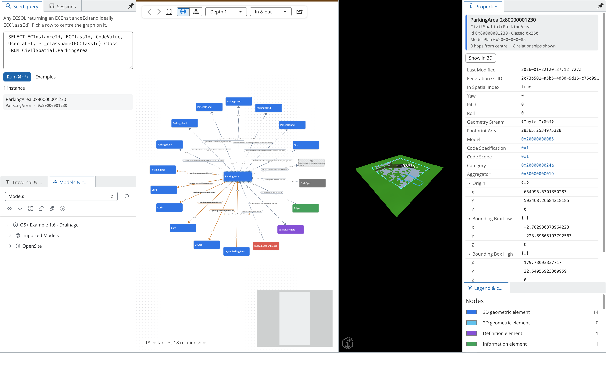
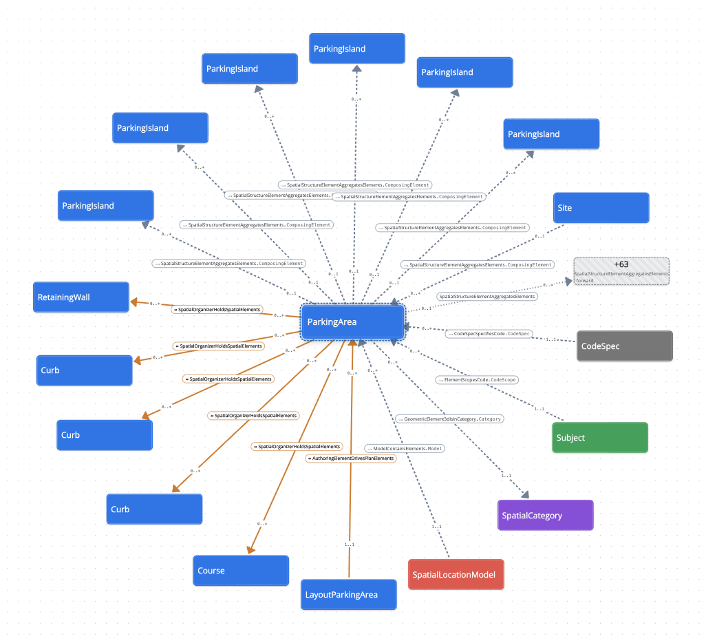
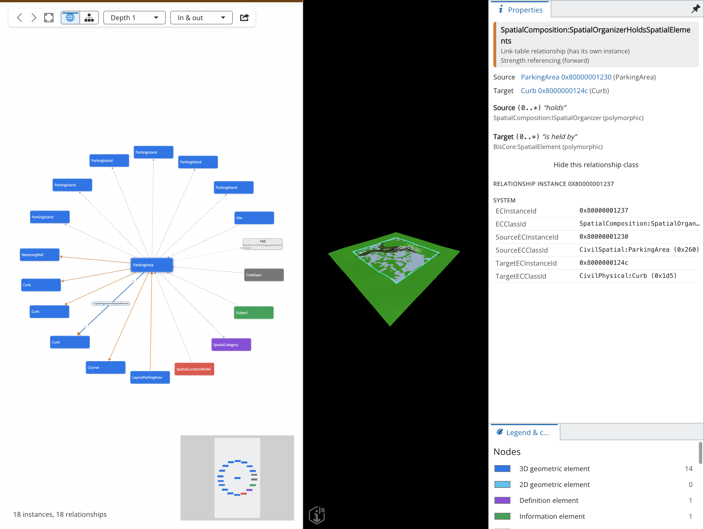
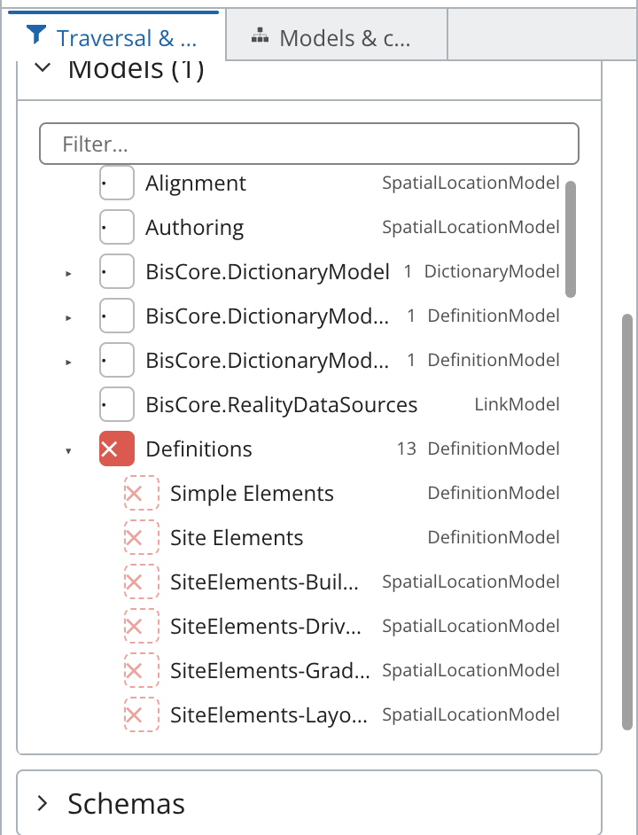
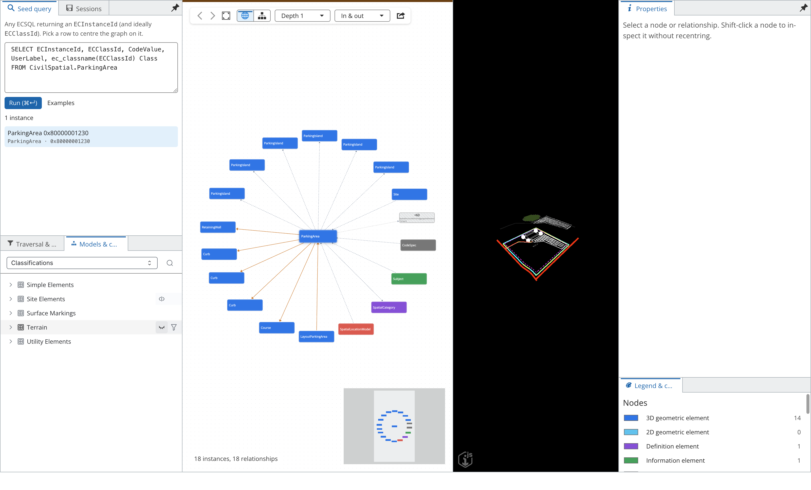

# iModel Data Explorer

A developer tool for looking at the **instance graph** of an iModel: the actual EC instances and the
relationships between them, rather than the schema. Open a `.bim` file, pick a starting instance
with any ECSQL query, and explore what it is connected to — its parts, category, model, code spec,
the link-table relationships that feed it, and so on outward, as deep as you like.



Built on iTwin.js 5.x (Electron, AppUI, iTwinUI, ECPresentation), React Flow and elkjs.

> Screenshots use the OpenSite+ *Example 1.6 – Drainage* iModel. Regenerate them with
> `npm run screenshots -- <path-to-that.bim>`.

## Why

A schema tells you what *could* be connected; this shows what *is*. Questions like "what is this
parking area actually related to, through which relationship classes, with what cardinality, and
what sits two hops further out?" usually mean hand-writing a chain of ECSQL joins. Here you pick the
instance and read the answer off the graph.

## Features

- **ECSQL seed.** Any query that returns an `ECInstanceId` picks the instance at the centre.
- **Centred, animated graph.** The seed sits in the middle with one ring per hop. Click any node to
  recentre on it; back/forward history keeps you from getting lost. Choose depth (1–6) and
  direction (in, out, both), or expand a single node by one hop.
- **Both kinds of relationship.** Traversal uses the experimental `ECVLib.Relations()` virtual table
  (with a metadata-driven fallback), so it finds **navigation-property** relationships and
  **link-table** relationships in both directions. Link-table edges are solid orange and can be
  selected to see the relationship instance's own properties; navigation edges are dashed and
  labelled `Relationship.NavProperty`.
- **Cardinality.** Every edge shows its source and target multiplicities (`0..1`, `0..*`, …) from the
  `ECRelationshipClass` constraints.
- **Properties pane.** Class, id, model and every readable property of a node; navigation values
  are links that recentre the graph.
- **Include / exclude filters** by model (as a model hierarchy), schema, class (optionally
  polymorphic) and relationship class, applied during traversal.
- **Colouring** by category — 3D/2D geometric, definition, information, role, model, aspect — with
  customisable colours and custom rules by class or schema.
- **Hub safety.** Large fan-outs (a CodeSpec, a category, a root subject) collapse to `+N` summary
  nodes that you can open on demand; a node budget caps the whole graph.
- **3D view** with two-way selection sync, plus ECPresentation **visibility trees** (models,
  categories, classifications) to hide content such as terrain.
- **Sessions and export.** Save and restore sessions; export JSON, GraphML or PNG, or copy an ECSQL
  recipe that reproduces the traversal.

### The graph

Centred on a `CivilSpatial:ParkingArea`: orange link-table edges to the curbs, islands and wall it
organises (`SpatialOrganizerHoldsSpatialElements`), dashed navigation edges to its model, category,
code spec and code scope, multiplicities at each end, and a `+63` summary node for the rest of an
aggregation.



### Relationships and their properties

Selecting a link-table edge shows its relationship class, strength and direction, both constraints
with multiplicity and role labels, and the relationship instance's own properties.



### Filters and visibility

Models are filtered as a tree: excluding a model (✗) also excludes its sub-models, shown as faint
dashed marks, unless a sub-model overrides it. The **Models & categories** tab holds the
ECPresentation visibility trees; here the *Terrain* classification is hidden in the 3D view.

| Model filter hierarchy | Visibility trees |
|---|---|
|  |  |

## Quick start

Requires Node.js 22 and macOS, Windows or Linux. The `@itwin/*` packages are `5.14.0-dev` builds,
which provide `ECVLib.Relations()` and `IModelConnection.getSchemaView()`.

```bash
npm install        # also copies @itwin static assets into public/
npm run sample     # writes samples/pump-network.bim (pumps, pipes, nav + link-table relationships)
npm start          # build + launch Electron
```

`npm run dev` runs Vite with hot reload and launches Electron against it (`IG_DEV=1`).

Open a snapshot or briefcase (`.bim`) from the welcome page. Briefcases open read-only.

## Using it

| Where | What |
|---|---|
| **Seed query** (left) | Run any ECSQL. The id comes from an `ECInstanceId`/`Id`/`ElementId` column, or the first id-looking value. The class comes from `ECClassId` or a class-name column, otherwise it is looked up. Click a result to centre the graph on it. **Examples** has ready-made queries. |
| **Graph** (centre) | The selected instance sits in the middle, with one ring per hop around it. **Click** a node to recentre on it. Degree 1 loads first and deeper rings stream in. **Shift/⌘-click** selects without recentring. **+/−** expands or collapses a single node, and **▾** previews its properties inline. `+N` summary nodes stand in for large fan-outs; click one to load them. **Alt+←/→** goes back and forward, **F** fits the view. |
| **Toolbar** | Back and forward, fit, radial or layered (elk) layout, depth (1–6), direction (in, out, both). **Export** to JSON or GraphML (yEd, Gephi, Cytoscape), save a PNG, or copy an ECSQL recipe that reproduces the traversal. |
| **Traversal & filters** (left) | Depth, direction, group cap (edges per relationship class before a summary node is used), node budget, and a Relations()/fallback toggle. Filters are tri-state (· any, ✓ include only, ✗ exclude) per **Model**, **Schema**, **Class** (optionally polymorphic) and **Relationship**. Models are shown as a tree: a sub-model sits under the model that contains its modeled element (for example a DefinitionContainer's model, or an alignment model under a road network). A sub-model with no state of its own inherits its nearest ancestor's (drawn as a faint dashed mark), so excluding a model hides everything beneath it, and a sub-model can override it. The centre is never hidden. |
| **Properties** (right) | For a node: class, id, model, hop distance, and every readable property; clicking a navigation value jumps to that instance. For an edge: the relationship class, strength and direction, source and target constraints with multiplicity, and, for **link-table** relationships, the relationship instance's own properties. |
| **Legend & colours** (right) | Counts per category, plus colour pickers for each category (3D or 2D geometric, definition, information, role, model, aspect, other) and ordered custom rules by class (polymorphic or exact) or by schema. |
| **Sessions** (left) | Save or restore the centre, options, filters and expanded nodes (stored in localStorage), and import or export them as JSON files. |
| **Models & categories** (left, next to Traversal & filters) | ECPresentation visibility trees from `@itwin/tree-widget-react` (the same trees OpenSite+ uses). Pick **Models**, **Categories** or **Classifications**, then use a row's eye button to show or hide that content in the 3D view (for example, hide terrain). **Classifications** only appears when the iModel has `ClassificationSystems` data; if there are several systems, a picker chooses between them, and it starts on the system with the most classified elements. Selecting an element node in a tree recentres the graph on it. |
| **3D view** (right of graph) | Selecting a node selects and highlights the element in the view, and selecting one element in the view recentres the graph on it. **Show in 3D** zooms to it. |

Edges: a solid orange line is a **link-table** relationship (it has its own ECInstance and may have
properties); a dashed line is a **navigation property** (the label shows `Rel.NavProp`); a dotted line
leads to a summary node. The numbers near each end are the relationship's constraint multiplicities,
for example `0..1` and `0..*`.

## How it works

```
src/
  backend/main.ts            Electron host shim (the only Electron-specific file)
  common/appInfo.ts          RPC interfaces shared by both sides
  frontend/
    engine/                  UI-free traversal engine; runs against IModelConnection or IModelDb
      IModelQueryPort.ts       createQueryReader + getSchemaView abstraction
      TraversalStrategy.ts     ECVLib.Relations() strategy + metadata fallback, capability probe
      GraphEngine.ts           hop-by-hop BFS, group caps, node budget, filters, cancellation
      relationshipInfo.ts      cardinality/strength/direction from ECRelationshipClass
      resolveNodes.ts          labels, models, categories in batched queries
      seedQuery.ts             user ECSQL -> seed instances
    state/                   zustand store, navigation history, colour theme
    graph/                   React Flow canvas, custom nodes/edges, radial + elk layouts, animation
    widgets/                 AppUI widgets (seed, filters, properties, legend, sessions)
    content/, frontstages/   AppUI content (graph + viewport) and frontstage
```

* **Frontend-first.** All graph work runs in the renderer through `IModelConnection.createQueryReader`
  and the schema context, and there is no custom IPC. The backend only opens files and serves tiles,
  so moving this into a Studio host means replacing `src/backend/main.ts` and `src/frontend/host/`.
* **Traversal.** When the iModel supports it, the engine uses the experimental
  `ECVLib.Relations(ECInstanceId, ECClassId)` table function (`ECSQLOPTIONS ENABLE_EXPERIMENTAL_FEATURES`),
  which returns both navigation-property and link-table relationships in both directions. On older
  runtimes it falls back to walking `ECRelationshipClass` metadata: nav properties on the instance's
  class, reverse nav lookups, and link-table source/target queries. The two strategies are
  parity-tested.
* **Hubs and large fans.** A CodeSpec, root Subject, model or category can have hundreds of
  thousands of related instances. Each (instance, relationship class, direction) group beyond the
  *group cap* becomes a `+N` summary node, and it is capped **server-side**, so only about
  `2 × groupCap + 10` rows per group are fetched (`nodeBudget × 2` once the summary is opened). The
  hidden count comes from a server-side total, minus the instances already on the graph. Links from
  a capped group to instances already on the graph are still fetched, so no cross-links are lost.
  Under class filters the `+N` is an upper bound, because it counts rows before class filtering.
  Which instances represent a capped group is arbitrary and can differ between strategies.
  * The fallback probes each relationship query with `LIMIT`, then uses indexed `COUNT`/`LIMIT`
    queries per relationship class.
  * `Relations()` can't push a relationship-class filter into the virtual table, so capping a hub
    would still enumerate its whole fan. That takes minutes for a CodeSpec on a 40 GB iModel, until
    ConcurrentQuery gives up. Instead, each batch is probed with `LIMIT 2000`. Rows arrive grouped
    by seed, so seeds before the one the probe stopped in are complete. A seed that fills the probe
    on its own is a hub, and it is expanded by the fallback's indexed queries. Without a fallback,
    one `ROW_NUMBER()/COUNT() OVER (PARTITION BY …)` scan is used instead.
  * If a `Relations()` statement fails (for example, a ConcurrentQuery time-out), that batch is
    answered by the fallback and the status bar says so.
* **3D view fit.** A few stray elements can inflate the project extents (the plant test file has
  elements at the origin and at 890 km while the site sits at 440 km, 280 km), so the default view
  fit showed nothing. The viewport samples `bis.SpatialIndex` evenly, keeps only boxes that
  intersect the project extents, and fits to their 1st–99th percentile range whenever that is less
  than half the size of the default view (which `ViewCreator3d` fits to model extents).
* **Visibility trees.** `@itwin/tree-widget-react` 4 (alpha) is built on StrataKit, so the app is
  wrapped in the StrataKit `Root`. The trees need `ECSchemaRpcInterface` (registered on the backend
  with `ECSchemaRpcImpl.register()`) and `PresentationRpcInterface`, with `Presentation.initialize`
  on both sides, a shared `@itwin/unified-selection` storage, and the tree-widget localisation
  namespaces. After installing packages, run `npm run copy-assets` so their locale files reach
  `public/`.
* **Id sets.** Batched lookups use validated `ECInstanceId IN (…)` lists rather than
  `InVirtualSet()`, which is a per-row function call that forces a full table scan: about 0.7 s
  per lookup on a 40 GB iModel, versus about 0 ms.
* **Identity.** Nodes are keyed by `classId:id`, because a partition and its sub-model share an id.
* **Layout.** The radial layout is a leaf-weighted wedge tree with per-ring de-overlap and a rotation
  that keeps the previous centre on the same bearing, so recentring reads as camera motion. The
  layered layout is elk "layered" running in elk's worker. Transitions use a small animator
  (ease-in-out; honours `prefers-reduced-motion`).

## Scripts

| | |
|---|---|
| `npm test` | Vitest: engine against a generated SnapshotDb (both strategies), plus layout, motion, history, theme, sessions and exporters |
| `npm run typecheck` / `npm run lint` | tsc (frontend and backend) and ESLint |
| `npm run build` | Backend tsc and Vite to `dist/` |
| `npm run sample [out.bim]` | Generates the demo iModel |
| `npm run smoke [file.bim] [ecsql]` | Playwright-driven end-to-end run of the built app; writes screenshots to `dist/smoke/` |
| `npm run screenshots -- file.bim [outDir]` | Regenerates the README images from the built app (run `npm run build` first) (expects the OpenSite+ drainage example; defaults to `docs/images/`) |
| `npm run bench -- file.bim "<ecsql>"…` | Times seed queries, depth 1–3 traversals and property loads with both strategies, read-only (`MAX_DEPTH=2` for huge files) |

In the renderer devtools console, `imodelExplorer.openAndShow(path)`, `imodelExplorer.graphActions`
and `imodelExplorer.getState()` are available for scripting, plus `imodelExplorer.IModelApp`.
