# Tutorial: exploring the Riverbend water plant

This walkthrough visits every panel of iModel Data Explorer using the demo iModel,
`samples/water-plant.bim`. The screenshots are cropped to the widget being described and use the
dark theme. To regenerate them, see [Regenerating the screenshots](#regenerating-the-screenshots).

For a one-minute narrated overview, watch [tutorial.mp4](tutorial.mp4).

## 1. Get the model

```bash
npm install
npm run sample:demo   # writes samples/water-plant.bim
npm start
```

The welcome page has **Open iModel…** and a list of recent files. Open
`samples/water-plant.bim`.

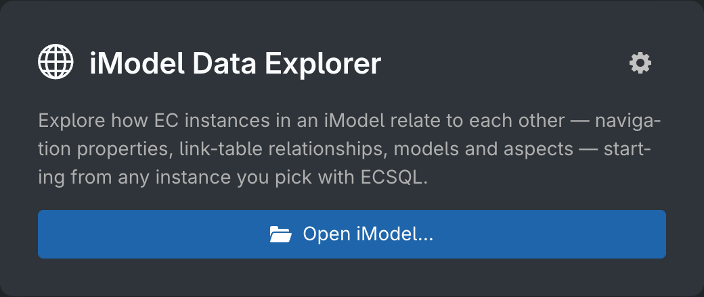

## 2. App settings and theme

The gear icon at the end of the graph toolbar opens **App settings**. Under **Appearance**, choose
System, Light, Dark or High contrast. The switches below it turn off optional features (Overview,
class graph, Schema, Geometry, visibility trees and more), which skips their queries. Settings
persist across iModels.

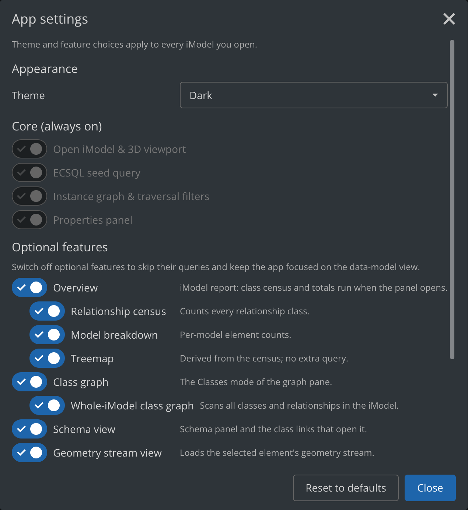

## 3. Pick a seed with ECSQL

In **Seed query**, enter any ECSQL query that returns `ECInstanceId` (ideally also `ECClassId`),
then press **Run** (⌘↵). **Examples** inserts ready-made queries. Click a result row to centre
the graph on that instance.

```sql
SELECT ECInstanceId, ECClassId FROM WaterPlant.Pump
```

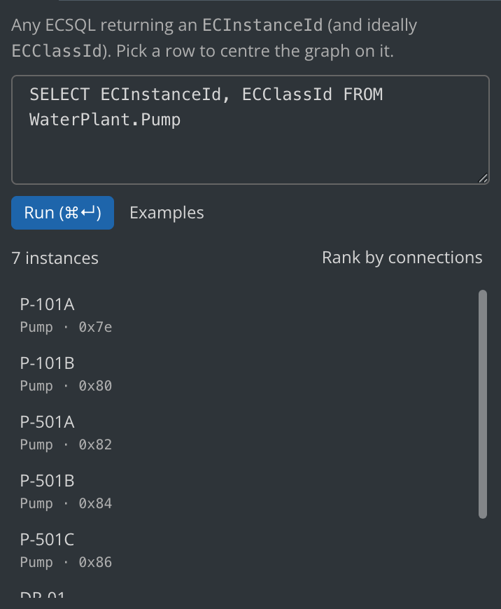

## 4. The graph toolbar

The **Close iModel** X sits above the graph toolbar, leaving its controls unobstructed.


From left to right:

- **Instances / Classes**: switch between the instance graph and the class graph.
- **Back / Forward** (Alt+← / Alt+→): retrace your steps.
- **Fit to view** (F).
- **Radial / Layered**: the layout.
- **Depth** (1–6 hops) and **direction**: in & out, outgoing or incoming.
- **Export**.
- **App settings**.

When you have navigated more than once, **breadcrumbs** above the toolbar list each stop in the
history; click one to jump straight back to it. Jumping back keeps the forward stops, so
**Forward** still works.

### Command palette, menu and shortcuts

Press **Cmd/Ctrl+K** to open the command palette. Type part of a command name ("radial", "fit",
"theme") and press Enter to run it. Typing also searches instances by UserLabel, CodeValue or exact
ID. Enter centres the graph on the selected instance; **Shift+Enter** finds a path to it from the
current centre. Every palette command is also in the native **File / Edit / View / Graph** menus.
Unavailable commands say why in the palette.

### Find in graph

**Cmd/Ctrl+F** opens a find bar over the graph. Matching nodes (by label, class or ID) are
highlighted and the rest dimmed. Enter and Shift+Enter move to the next and previous match and pan
to it; the counter shows "n of m". Escape closes the bar.

## 5. Read the graph

Click **P-101A**. The pump sits in the centre, with its depth-1 neighbours around it: motor, pipes,
clarifier, tank, work orders, train, process area, P&ID symbol, type definition, category, model
and aspect.

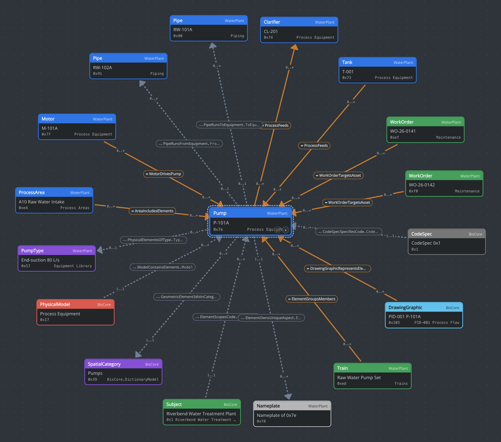

- **Solid orange edges** are link-table relationships, such as `MotorDrivesPump` and
  `WorkOrderTargetsAsset`. Each one is an instance in its own right and can have properties.
- **Dashed edges** are navigation properties, such as `PhysicalElementIsOfType.TypeDefinition`.
  The label names the property.
- The numbers at each end (`0..*`, `1..1`) are the multiplicities of the relationship
  constraints.

Each node shows its class, schema, label, ID and model. The node buttons are 📌 (pin), ▾ (preview
properties) and + (expand one hop here).

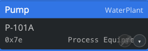

Click a node to recentre on it. Use Back to return.

## 6. Properties of nodes and relationships

The graph toolbar's **Tool** menu lets you apply filters directly on the canvas. Icons beside the
menu labels and active tool identify the target: a pointer for Navigate, a link for relationships,
layers for classes, a single selection for an instance, and a model for models. A **+** badge means
Include; a **−** badge means Exclude.

Select Include or
Exclude relationship type, then click an edge (or a `+N` relationship group). For node classes or
models, choose the matching tool and click an ordinary node. Class/type tools match the exact class;
use the Filters panel's **+ subclasses** checkbox for polymorphic matching. Include creates an
allowlist in that filter dimension, not a highlight or an override of other exclusions. Model
filters apply to the containing model, and sub-models inherit their parent's state unless overridden.

**Exclude this instance** removes only the clicked instance and traversal paths through it, without
excluding its siblings. It also removes its pin and clears Back/Forward history. The centre cannot
be excluded individually; class/model exclusion still applies to other nodes while keeping the
centre visible. Manage individual exclusions under **Excluded instances** in Filters, or use
**Clear all** to remove every filter. Removing an instance exclusion does not restore its old pin.
Class/model filters retain the existing pinned-node overlay behavior; use instance exclusion to
remove a pinned instance completely.
Instance exclusions survive navigation and are saved with sessions, but clear when you close or
switch iModels.

Tools remain active for repeated clicks until **Escape**, **Navigate**, or switching to the class
graph. While a tool is active, clicks apply it rather than recentring, including modifier-clicks.
Invalid targets show a message without changing filters. Node Pin, preview, and expand buttons
remain independent of the selected tool.

When a node is selected, **Properties** shows a header card (class, IDs, model, hop count and
relationship count), **Pin** and **Show in 3D** buttons, and then the ECPresentation property grid
for elements, with categorized, formatted values, including schema-hidden fields and properties
from unique and multi aspects. Expand the aspect categories to inspect their values. This uses
generic explorer rules, not application-specific computed fields or custom related-property paths.
The **Element** category opens expanded by default; you can collapse it manually.
Other EC instances retain raw properties. P-101A
has the domain properties Tag, Description, Criticality and MaintenanceIntervalDays.

Click a navigation-property value or a linked instance/model ID to centre the graph on its target.
Model links resolve the model class, not the partition element that shares its ID. Class IDs are
schema identifiers rather than graph instances and remain plain text.

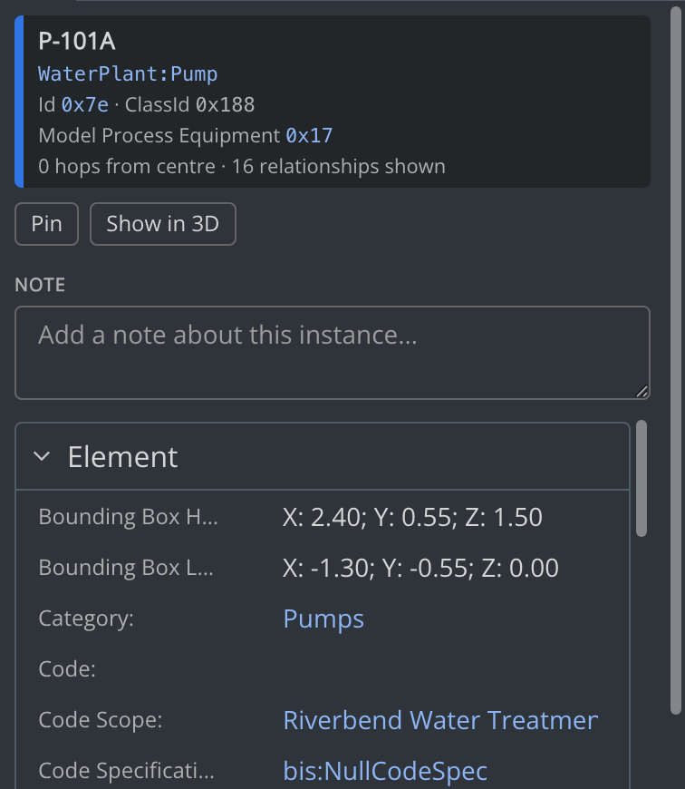

Select the `MotorDrivesPump` edge to see the properties of the relationship instance itself. In
this model, that is the coupling type **Flexible**.

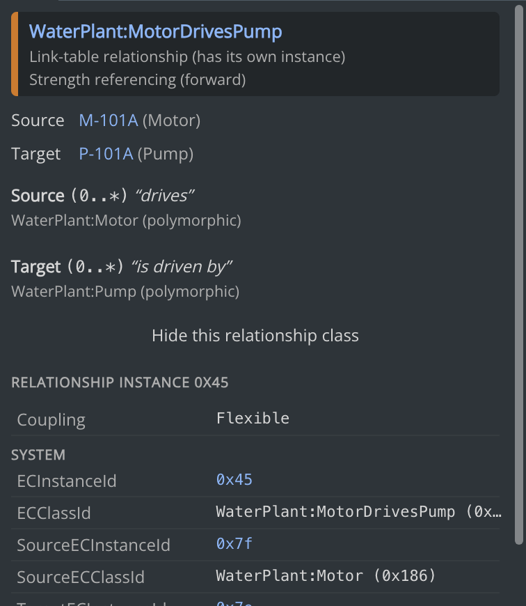

## 7. Layouts and direction

Choose **Layered** and set direction to **Outgoing** to see what P-101A points at: its category,
type, the pipes, the clarifier it feeds, and its nameplate aspect.

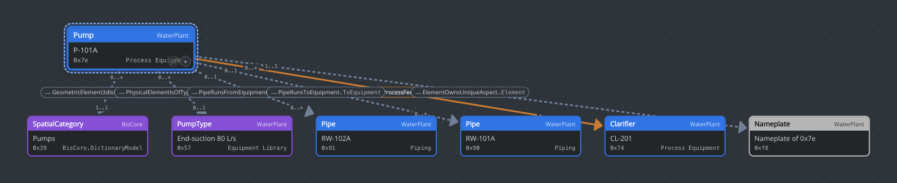

## 8. Hubs and `+N` aggregates

Header **H-601** has 45 relationships, 30 of them laterals. When one relationship has more
neighbours than the **Group cap** (Filters panel), the extras collapse into a dotted **+N**
summary node. Click it to load the rest. The shot below uses a cap of 8.

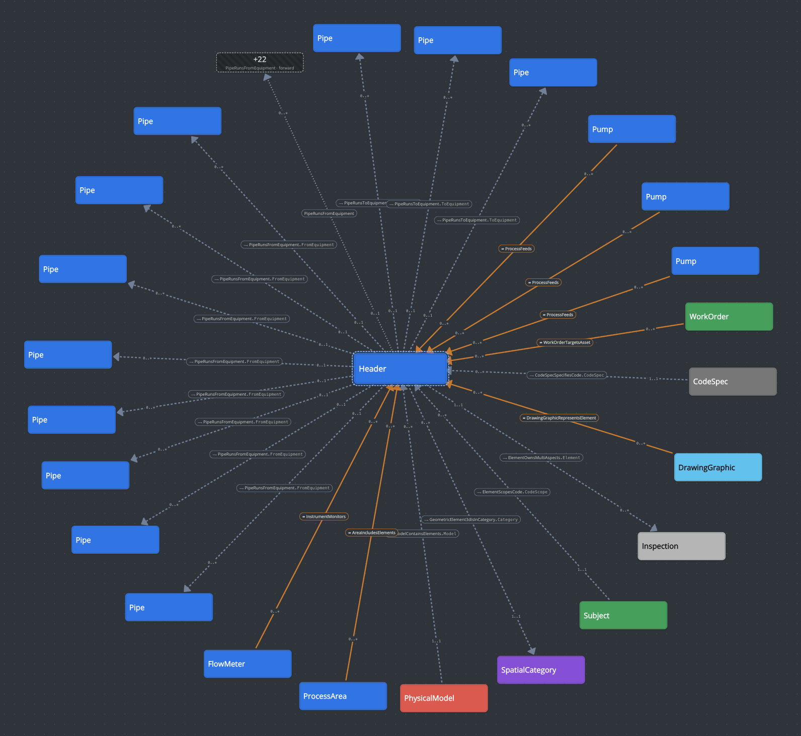

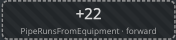

Zoomed out, nodes drop their detail rows so that large graphs stay readable.

## 9. Pins

Pin a node (📌 on the node, or P) to keep it in view while you move through the graph. The 📌
counter in the toolbar lists the pins and lets you centre on a pin, unpin it, or unpin all.

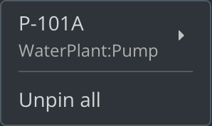

Here P-101A is pinned and the graph is centred on its motor, **M-101A**. The pump stays on
screen because it is still related to the centre. A pin is kept for as long as it is related to
the centre or to another pin.

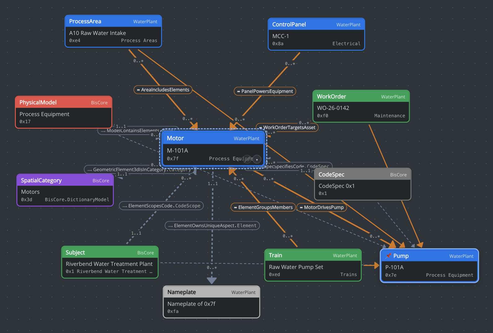

## 10. Filters

**Filters** narrows the traversal by model (as a hierarchy), schema, class or relationship. Each
row has a tri-state button that cycles through neutral, include (✓) and exclude (✕). Classes and
relationships can include subclasses. The panel also holds **Group cap**, **Node budget** and the
traversal strategy (`ECVLib.Relations()` or schema metadata).

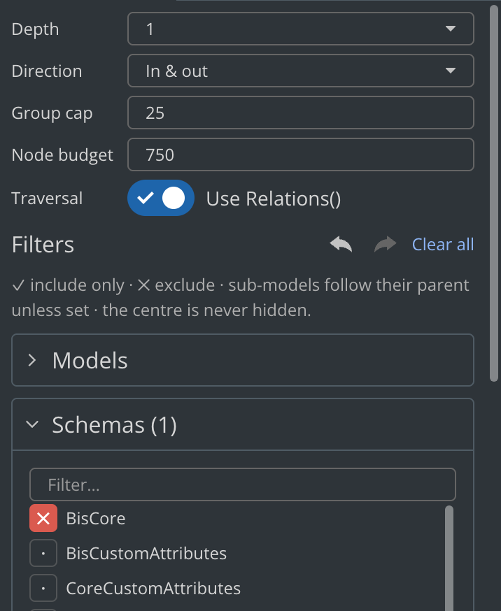

With the **BisCore** schema excluded, P-101A shows only the domain relationships.

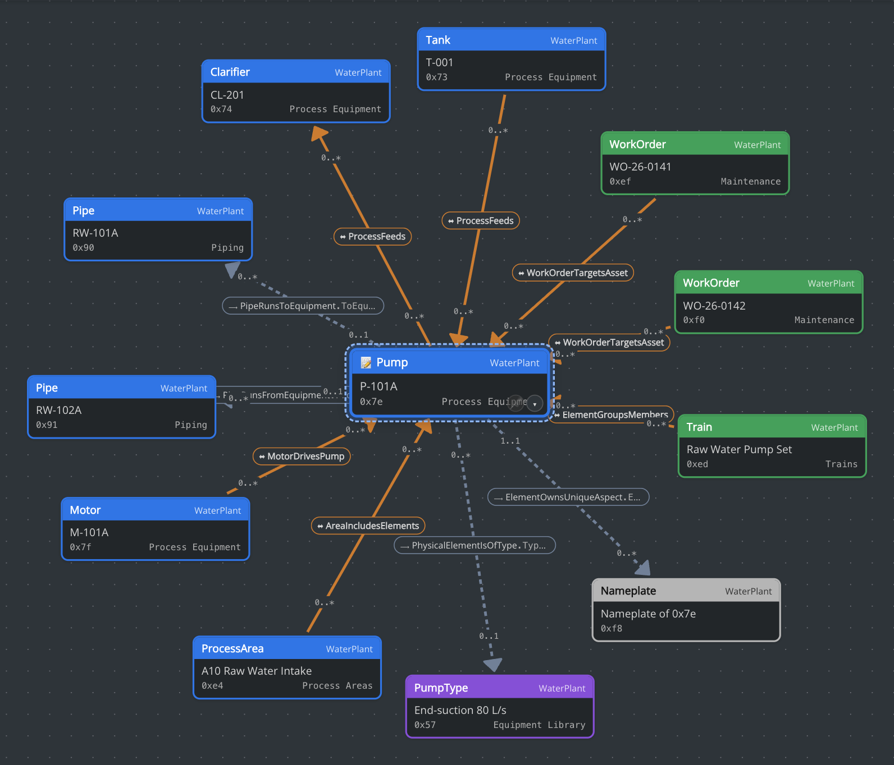

Filter and instance-exclusion changes can be undone with **Cmd/Ctrl+Z** (redo with
**Cmd/Ctrl+Shift+Z**) or with the Undo/Redo buttons at the top of the panel. History resets when you
close the iModel or restore a session.

### Finding a path

To see how two instances are connected, choose **Find path from centre** in the tool menu and
click a node, use **Graph → Find path from centre to selected node**, or press Shift+Enter on an
instance in the palette. The graph switches to the shortest path, up to 6 hops, using the current
direction, filters and instance exclusions, so filter to just the relationships you care about
first. Long searches show progress and can be cancelled with Escape or the Cancel button. If no
path exists within the limits, a status message says why. The path is a history stop, so Back
returns to where you were.

## 11. Schema

**Schema** shows the selected instance's class definition: base-class chain, mixins
(`IMaintainable`), properties with their types (including the `DutyPoint` struct) and derived
classes.

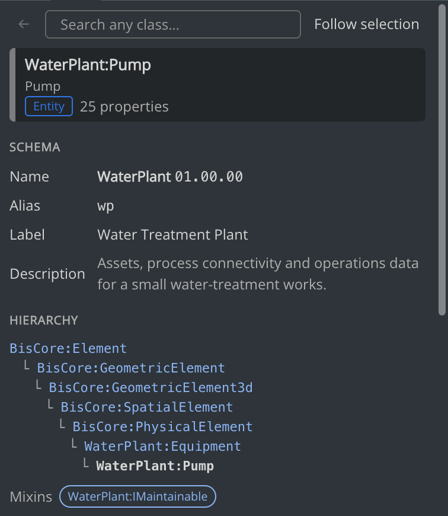

## 12. Geometry

**Geometry** decodes the selected element's geometry stream op by op. For P-101A, that is a box
base with sphere and cone primitives. Expand an op to inspect its formatted facts and appearance.
Further sections show placement, category and sub-categories, the view and the iModel
frame. Toggles control following the selection, BRep data and the range-and-axes decorator in the
3D view. You can export the stream as JSON.

Part IDs in the op list and part, category, sub-category, line-style and material IDs in the details
are links: click one to centre the graph on that instance. Missing references and query errors are
reported in the graph status; Back returns to the previous centre.

Search ops by type, ID or formatted facts, or filter to **Primitives**, **Appearance**, **Parts** or
**Unparsed**. Original op numbers and resolved appearance are preserved; filters only change the
displayed rows. Expanded parts have their own search and filter controls. Expand an op, then
**Raw JSON**, to inspect the stored entry or **Copy JSON** to copy it. Raw JSON is also available
for unknown or unparsed ops.

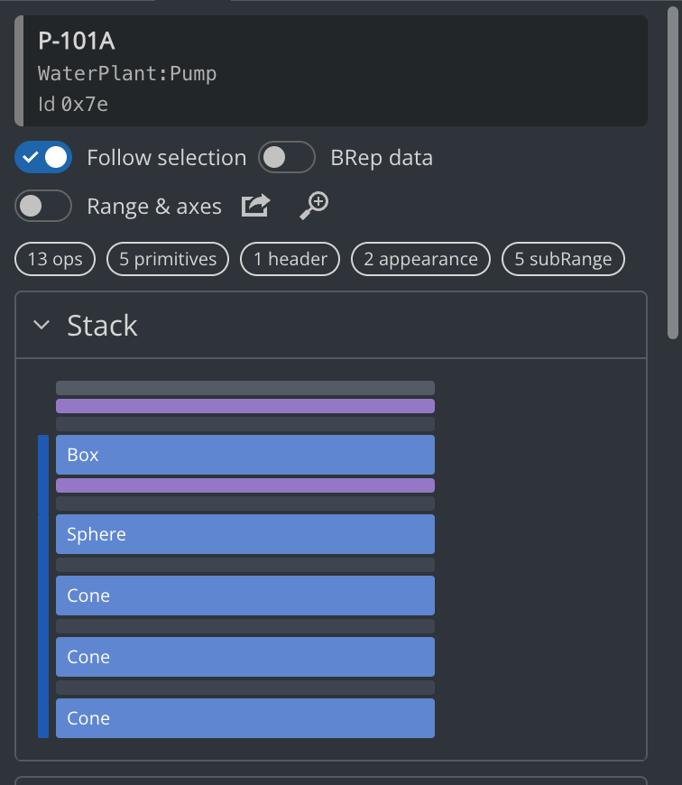

## 13. Overview: a census of the iModel

**Overview** counts everything: 326 instances of 44 classes from 2 schemas. WaterPlant uses 22
classes and has 190 instances. Click a class to list its instances in Seed query. Use the
tri-state button to filter the traversal from that row.

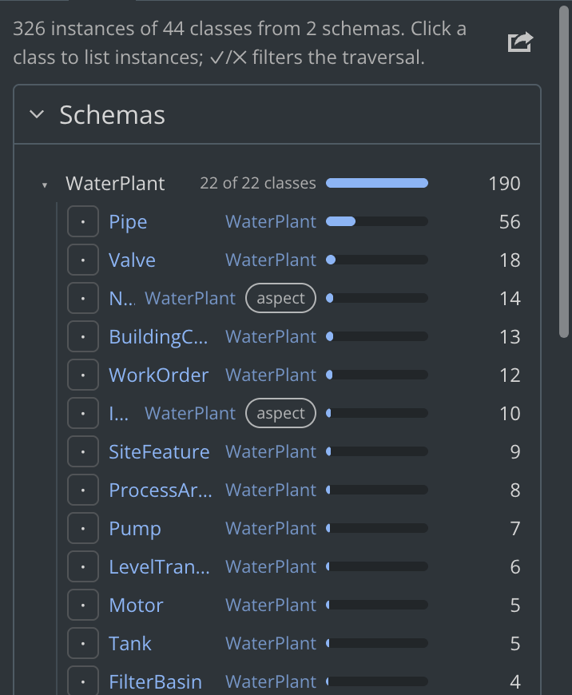

The **Relationships** section counts the instances of each relationship class. Here the top ones
are `AreaIncludesElements` (113), `ProcessFeeds` and `WorkOrderTargetsAsset` (26 each).

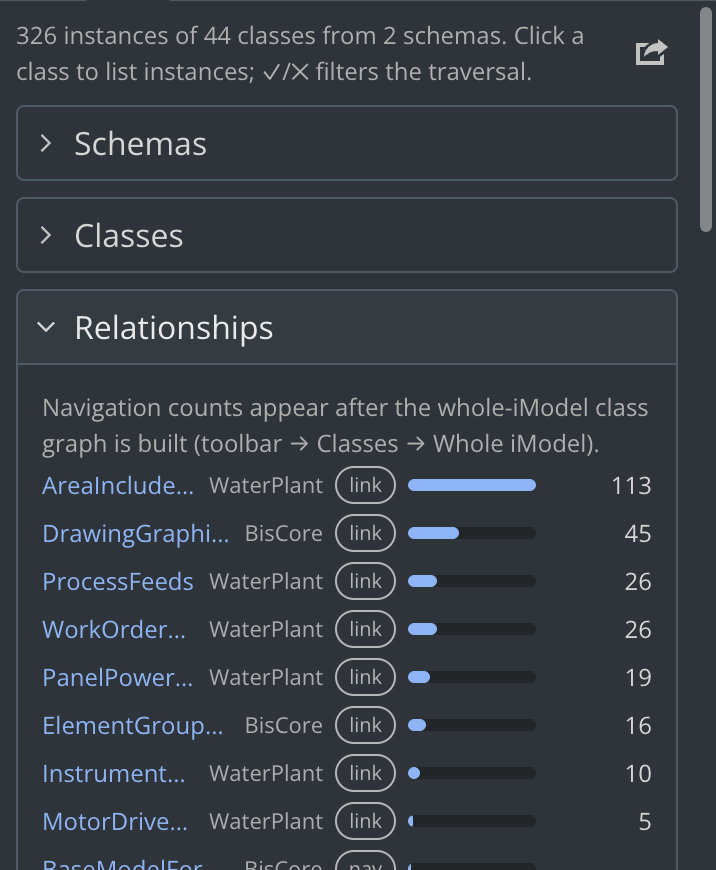

The **treemap** shows where the data lives. The census exports as CSV or Markdown.

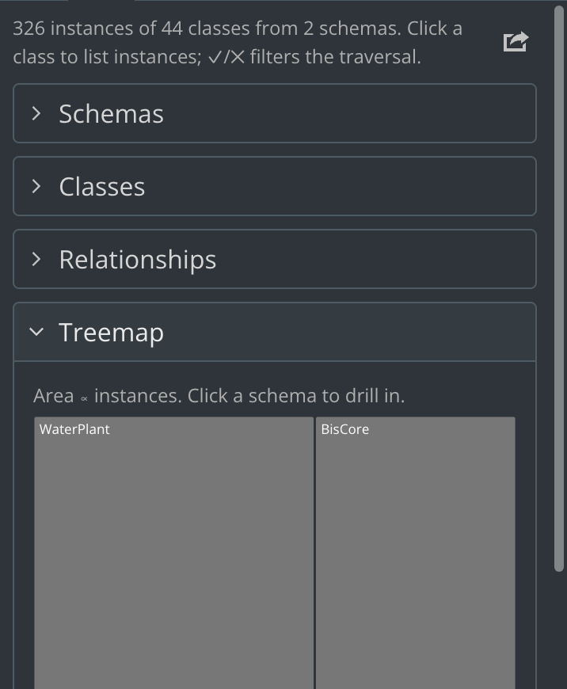

## 14. Rank by connections

Not sure where to start? Query all equipment, then click **Rank by connections**. The results are
sorted by relationship fan-out. H-601 comes top with 45, followed by the clarifiers and the tank.

```sql
SELECT ECInstanceId, ECClassId FROM WaterPlant.Equipment
```

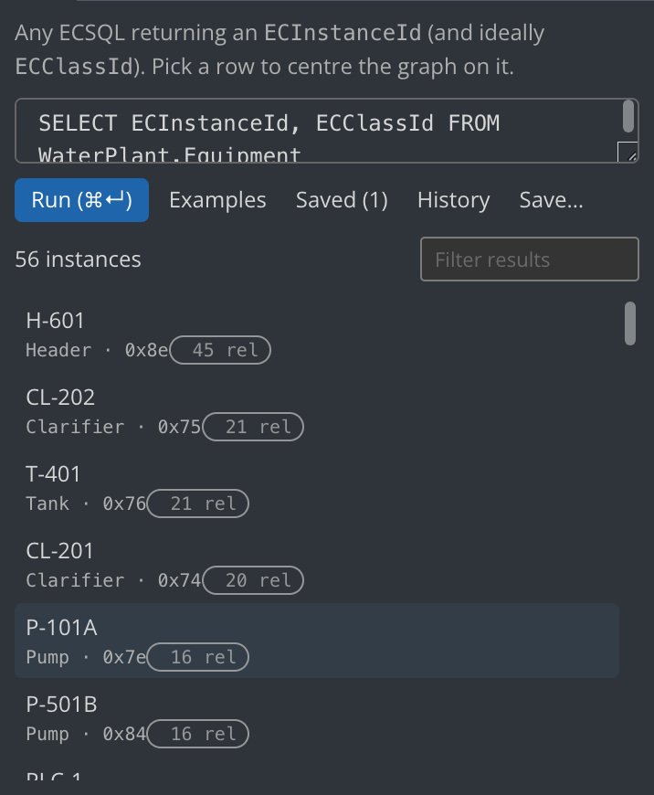

## 15. Class graph

Switch the toolbar to **Classes** to see the observed schema. There is one node per class, with
instance counts, and one edge per relationship class. By default the class graph collapses the
current neighbourhood; for P-101A that is 15 classes.

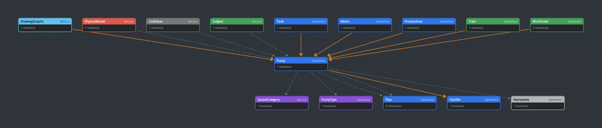

You can also build it for the whole iModel (45 classes, 215 relationships). Double-click a class
to go back to its instances.

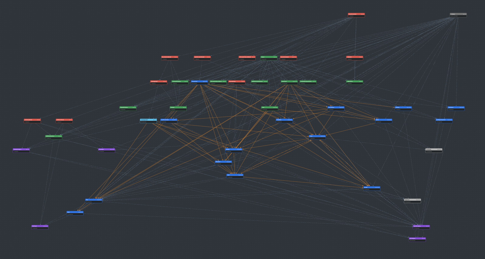

## 16. Legend and colour rules

**Legend** explains the node colours (element kinds) and edge styles, and counts how many of each
are on screen. Click a swatch to change a colour. **Custom colour rules** match a schema or class
(optionally with subclasses). The first matching rule wins. Here, work orders are highlighted in
pink.

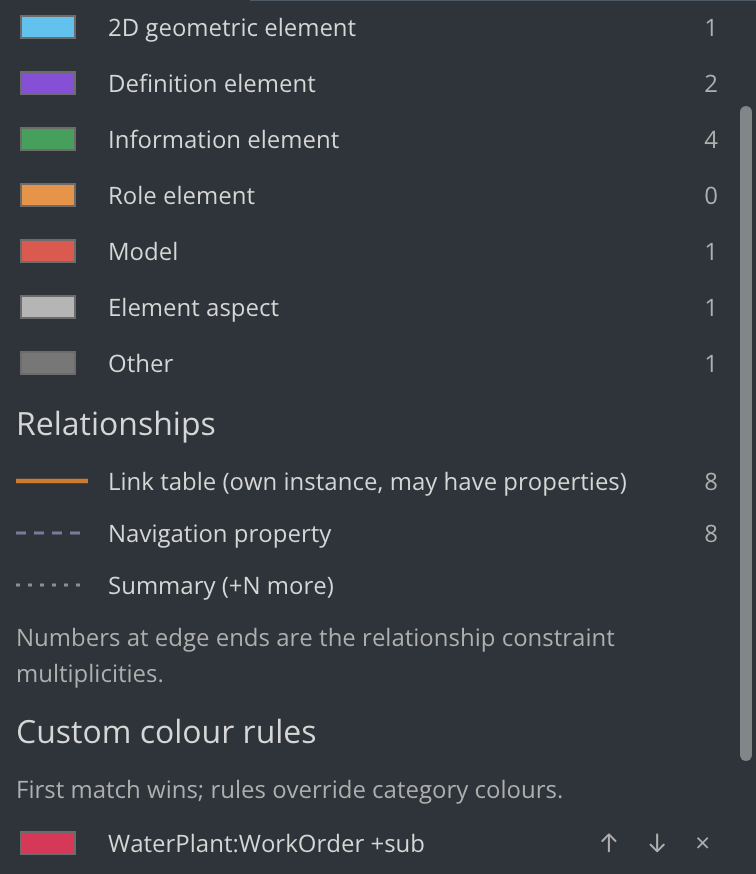

## 17. Sessions

**Sessions** saves the centre, depth, filters and manual expansions under a name, per iModel, and
replays them later.

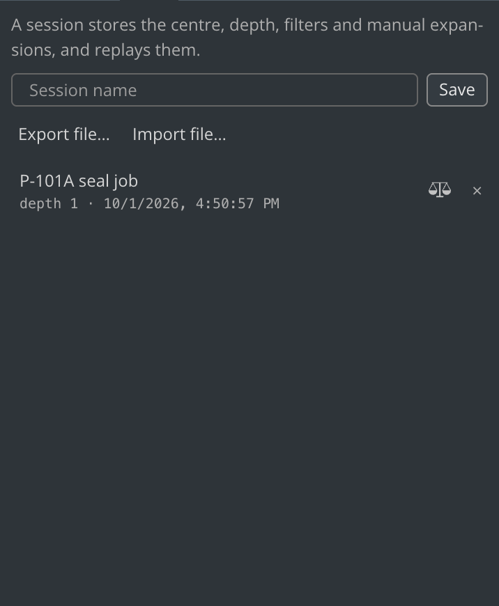

## 18. Export

The toolbar's **Export** menu writes JSON, GraphML, a CmapTools concept map (CXL) or a PNG image.
**Copy traversal as ECSQL** copies a query that reproduces the current traversal.

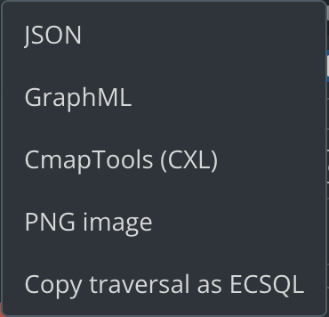

## 19. Models and categories

**Models & categories** shows the model, category and classification trees for the 3D view. The
plant's subjects are Civil & Site, Electrical & Controls, Operations and Process.

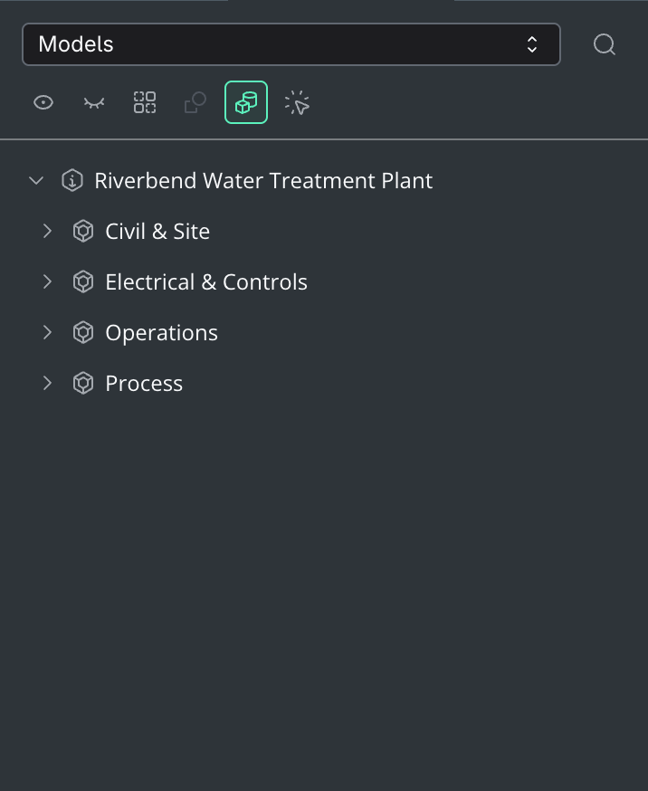

## 20. 3D view sync

Selection is synchronised in both directions: selecting a graph node highlights the element in
the 3D view, and picking an element in the view selects it in the graph. This is P-101A selected
in the view.

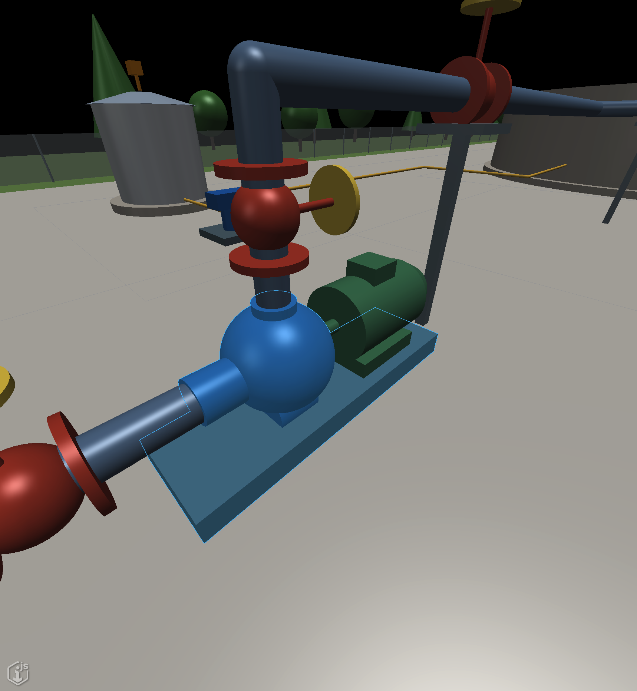

## Regenerating the screenshots

```bash
npm run build
npm run docs:shots       # writes docs/tutorial/*.png
npm run docs:tts-setup   # once: installs Kokoro TTS into ~/.cache/imodel-explorer/kokoro
npm run docs:video       # writes docs/tutorial.mp4
```

`scripts/tutorialShots.mjs` drives the built app with Playwright, using a temporary profile, a
1600×1000 window and the dark theme. It needs `samples/water-plant.bim` (`npm run sample:demo`)
and takes a few minutes.

`scripts/tutorialVideo.mjs` records the narrated video the same way. The narration is generated
offline by the [Kokoro](https://github.com/thewh1teagle/kokoro-onnx) neural voice `af_heart`.
`npm run docs:tts-setup` needs [uv](https://docs.astral.sh/uv/) and downloads about 350 MB. You
can choose another voice with `IG_VOICE`, or set `IG_TTS=say` to use the macOS `say` command instead.
`ffmpeg` must be on the `PATH` to combine the audio with the recording.
